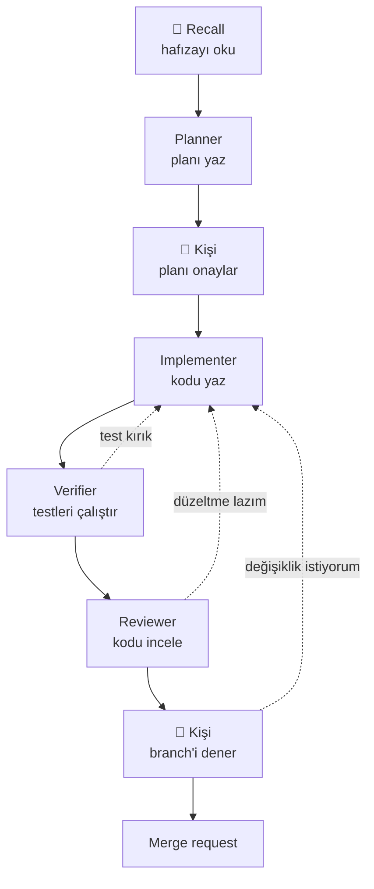
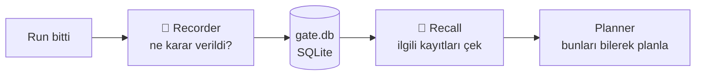
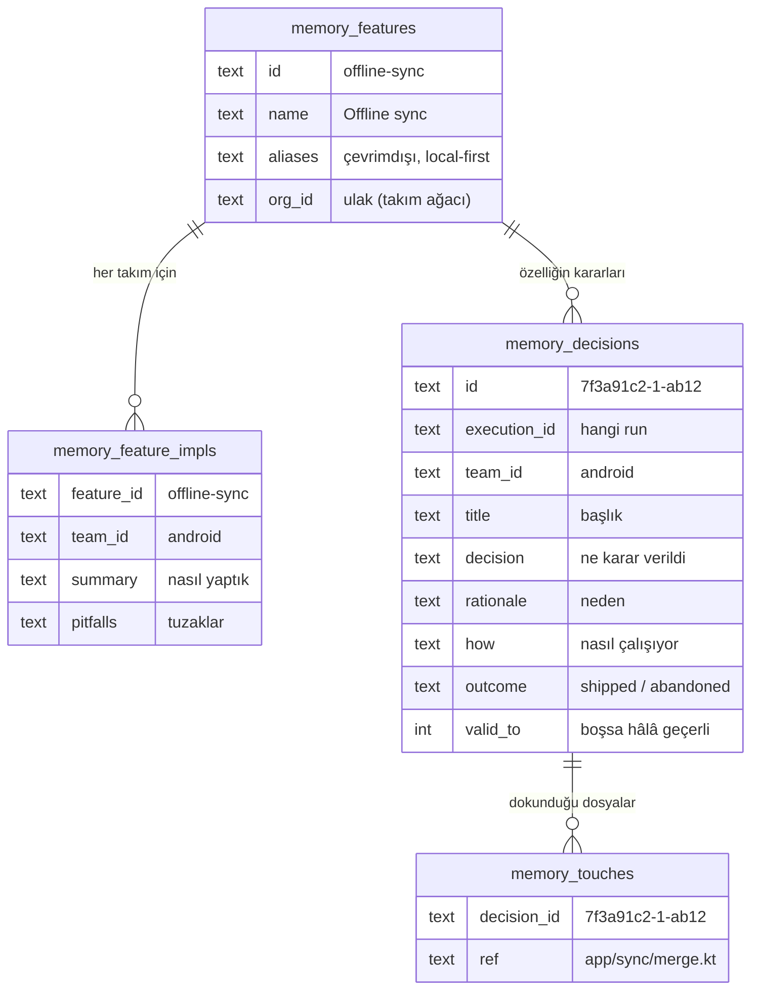
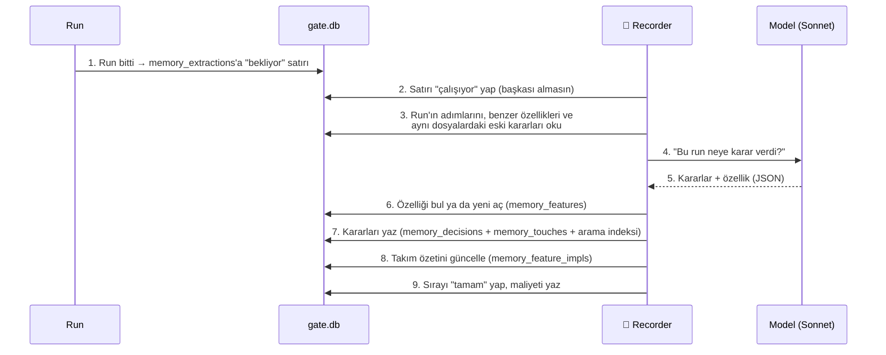
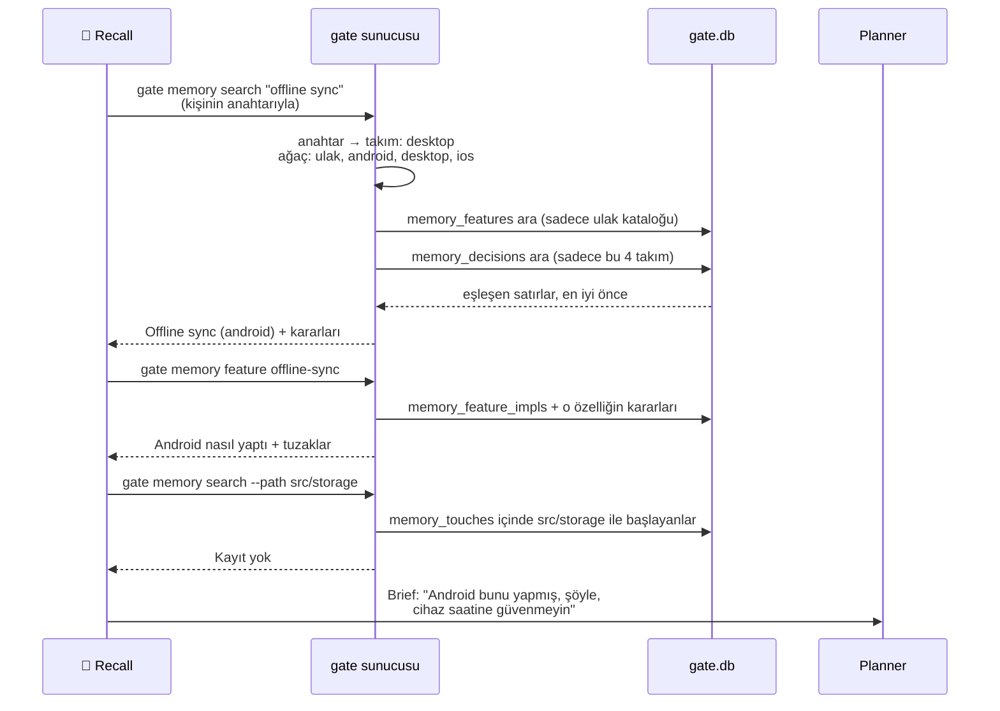
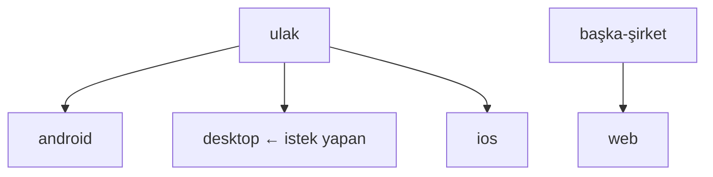

# gate — dev Workflow ve Hafıza

## 1. Özet

- `/gate:run dev "görev"` yazınca gate bir ekip gibi çalışır: **planlar, kişiye onaylatır, kodlar, test eder, inceler, kişiye denetir, merge request açar.**
- Her run kendi branch'inde çalışır. Senin çalıştığın koda dokunmaz.
- Her run bittiğinde **"ne karar verdik, neden"** veritabanına yazılır. Bir sonraki run işe başlamadan **önce bu kayıtları okur.**

---

## 2. dev akışı



Kesik oklar geri dönüşleri gösterir. Bir sorun bulunursa iş implementer'a geri gider.

**Önemli:** Bir sonraki adıma model karar vermez, workflow dosyası karar verir. Ajan sadece "onaylandı" ya da "reddedildi" der, gerisini dosyadaki kurallar belirler.

---

## 3. Ajanlar ne iş yapıyor?

| Ajan | Ne yapar |
| --- | --- |
| 🧠 **Recall** | Hafızada bu görevle ilgili ne var, bulur ve planner'a kısa bir not (brief) yazar |
| **Planner** | Brief'i ve kodu okur, gerekirse kişiye soru sorar, adım adım bir plan dosyası yazar |
| **Clarify** | Planner'ın sorularını kişiye iletir, cevapları geri götürür |
| **Plan review** | Planı kişiye gösterir: "Böyle yapalım mı?" |
| **Implementer** | Planı adım adım uygular. Önce testi yazar, sonra kodu. Her adımda bir commit atar |
| **Verifier** | Projenin tüm testlerini çalıştırır, planın her maddesinin yapıldığını kontrol eder |
| **Reviewer** | Kodu okur, "onay" ya da "şunu düzelt" der |
| **Acceptance** | Kişiye "hazır, dene" der, merge request açılsın mı diye sorar |

Kişi 3 yerde devreye girer: **soru** (clarify), **plan onayı** (plan review), **son onay** (acceptance). Kişi cevap verene kadar run bekler.

---

## 4. Hafıza

### 4.1 Fikir

Her run bittiğinde veritabanına bir **kayıt** bırakır. Yeni run başlarken önce bu kayıtları çeker.



Böylece:
- Android takımının yaptığı bir özelliği desktop takımı sıfırdan tasarlamaz.
- Daha önce bilerek alınmış bir karar yanlışlıkla bozulmaz.
- Denenip başarısız olmuş bir yol tekrar denenmez.

---

### 4.2 Veritabanında nasıl duruyor?

Her şey sunucudaki tek bir SQLite dosyasında durur: `~/.gate/gate.db`. Hafıza için 5 ana tablo var:



| Tablo | Ne tutar |
| --- | --- |
| `memory_features` | **Özellik kataloğu.** "Offline sync" gibi özelliğin adı ve diğer adları. Aynı takım ağacındaki herkes aynı kataloğu görür. |
| `memory_feature_impls` | **Takım başına özet.** "Android bu özelliği nasıl yaptı, hangi tuzaklara düştü." |
| `memory_decisions` | **Kararlar.** Her karar bir satır: başlık, ne, neden, nasıl, seçilmeyenler, riskler, hangi run, hangi commit. |
| `memory_touches` | **Kararın dokunduğu dosyalar.** Her dosya bir satır, böylece "bu klasörle ilgili kararlar" hızlıca bulunur. |
| `memory_extractions` | **Kayıt sırası.** Hangi run kaydedildi, hangisi bekliyor, hata aldı mı, maliyeti ne. |

Bunlara ek olarak kararlar ve özellikler için bir **arama indeksi** tutulur (SQLite FTS5). Google aramasına benzer: kelimeyle aranır, en iyi eşleşen önce gelir.

**Bir karar satırı örneği:**

| Alan | Değer |
| --- | --- |
| title | Çakışmada sunucu sürüm numarası kullan |
| decision | İki cihaz aynı kaydı değiştirirse sunucudaki sürüm numarası kazanır. |
| rationale | Cihaz saatleri güvenilir değil, veri kaybı oluyordu. |
| how | Değişiklikler cihazda kuyrukta bekler, bağlantı gelince sırayla gönderilir, sunucu alan alan karşılaştırır. |
| alternatives | Kullanıcıya çakışma ekranı göstermek. |
| consequences | Silme işlemi ayrı ele alınmalı. |
| team_id / outcome | android / shipped |
| base_commit..head_commit | 1a2b3c..9f8e7d |
| valid_to | boş (hâlâ geçerli) |

Kod yazılmaz, **mantık** yazılır. Amaç, diff'i görmeyen birinin de "neden böyle?" sorusunun cevabını anlaması.

---

### 4.3 Veritabanına nasıl kaydediliyor?



Adımlar:

1. **Sıraya alma.** Run nasıl biterse bitsin (başarılı, başarısız, durdurulmuş), sunucu `memory_extractions` tablosuna o run için bir "bekliyor" satırı ekler. Aynı run için ikinci bir satır açılmaz.
2. **İşi alma.** Recorder satırı "çalışıyor" yapar. Aynı anda başka bir işlem aynı run'ı alamaz, böylece bir run iki kez kaydedilmez.
3. **Okuma.** Recorder run'ın adımlarından **ajanların cevaplarını** alır: plan, implementer özeti, reviewer yorumu. Git komutlarının çıktılarını ve recall'ın kendi notunu almaz. Ayrıca veritabanından şunları çeker:
   - Katalogdaki **benzer özellikler**, bu iş onlardan birine ait olabilir.
   - Aynı dosyalara dokunmuş **eski kararlar**, bu run onlardan birini değiştirmiş olabilir.
4. **Modele sorma.** Hepsi tek bir mesajla modele verilir. Kurallar: "Her gerçek seçim bir karar olsun, kod değil mantık yaz, başarısız denemeyi de yaz."
5. **Cevap.** Model JSON döner: karar listesi ve işin hangi özelliğe ait olduğu.
6. **Özellik.** Model mevcut bir özelliği seçtiyse ona bağlanır, yeni isim verdiyse `memory_features` tablosuna yeni satır açılır.
7. **Kararlar.** Tek bir işlemde (transaction) yazılır:
   - Her karar `memory_decisions` tablosuna bir satır olarak eklenir.
   - Dokunduğu her dosya `memory_touches` tablosuna bir satır olarak eklenir.
   - Metin arama indeksine eklenir.
   - Karar eski bir kararın yerine geçiyorsa **eski satır silinmez**, `valid_to` alanına tarih yazılır ("şu tarihten beri geçerli değil").
8. **Özet.** `memory_feature_impls` tablosunda takımın "nasıl yaptık + tuzaklar" özeti güncellenir.
9. **Kapanış.** Sıra satırı "tamam" olur ve kaç karar yazıldığı, maliyeti kaydedilir. Hata olursa satır "hata" olur ve 3 kereye kadar tekrar denenir.

> Ajanlar veritabanına **yazamaz**. Yazan sadece recorder'dır, o da run bittikten sonra.

---

### 4.4 Veritabanından nasıl çekiliyor?

Recall ajanı planner'dan önce çalışır ve sunucuya birkaç soru sorar:



#### Adım 1: Kim neyi görebilir?

Sunucu önce isteği yapanın **anahtarından** takımını bulur, sonra o takımın ağacını çıkarır:



Desktop için okunabilir takımlar: `ulak, android, desktop, ios`. `başka-şirket` ve `web` asla gelmez. Bu liste sorgunun içine yazılır, model ne isterse istesin değişmez.

#### Adım 2: Kelimeyle arama

`gate memory search "offline sync için retry"` şu sorguya dönüşür (sadeleştirilmiş):

```sql
SELECT * FROM memory_decisions
WHERE arama_indeksi MATCH 'offline* OR sync* OR retry*'    -- "için" gibi dolgu kelimeler atılır
  AND team_id IN ('ulak', 'android', 'desktop', 'ios')     -- sadece kendi ağacın
  AND retracted_at IS NULL                                  -- geri çekilen kararlar hariç
ORDER BY
  team_id = 'desktop' DESC,                                 -- önce kendi takımın
  eşleşme_skoru                                             -- sonra en iyi eşleşme
LIMIT 10
```

- **Eşleşme skoru:** Kelime **başlıkta** geçiyorsa en yüksek puanı alır, sonra karar metni, sonra dosya adları, en az puanı "riskler" metni alır.
- **Kök bulma:** "notify" araması "notifications"ı da bulur.
- Özellikler için de aynı arama `memory_features` tablosunda yapılır (ad ve diğer adlar üzerinden).

#### Adım 3: Dosya yoluyla arama

`gate memory search --path src/storage`:

```sql
SELECT * FROM memory_decisions
WHERE id IN (
  SELECT decision_id FROM memory_touches
  WHERE ref LIKE 'src/storage%'        -- bu klasör altındaki her dosya
)
  AND team_id IN ('ulak', 'android', 'desktop', 'ios')
ORDER BY team_id = 'desktop' DESC, valid_from DESC   -- kendi takım önce, sonra en yeni
```

(Gerçekte `LIKE` yerine index üzerinden aralık araması yapılır, sonuç aynıdır ama çok daha hızlıdır.)

#### Adım 4: Özelliği açma

`gate memory feature offline-sync`:
1. `memory_features` tablosundan özelliğin kendisi.
2. `memory_feature_impls` tablosundan **her takımın** özeti ve tuzakları (önce kendi takımın).
3. `memory_decisions` tablosundan o özelliğe bağlı tüm kararlar.

#### Adım 5: Sonuç metne çevrilir

Satırlar modelin okuyacağı düz bir metne çevrilir:

```text
Features in the catalogue that match:
- offline-sync — Offline sync (also: çevrimdışı) · built by: android

## Çakışmada sunucu sürüm numarası kullan
id: 7f3a91c2-1-ab12 · team: android · shipped · from 2026-08-10
decision: İki cihaz aynı kaydı değiştirirse sunucudaki sürüm numarası kazanır.
why: Cihaz saatleri güvenilir değil, veri kaybı oluyordu.
how: Değişiklikler cihazda kuyrukta bekler, bağlantı gelince sırayla gönderilir...
touches: app/sync/merge.kt
```

Eski bir karar gelirse yanında `(no longer holds)` etiketi olur, yani "artık geçerli değil".

---

### 4.5 Recall neyi arar, brief'e ne yazar?

Recall genelde 3 açıdan arar:

1. **Özelliğin adıyla:** "offline sync", "çevrimdışı", "local-first"
2. **Dokunulacak klasörle:** `--path src/storage`
3. **Bir şey bozulduysa son dönemle:** `--path src/sync --since 30d`

Sonra planner'a bir brief yazar:

| Brief'te bulunan | Planner ne yapar |
| --- | --- |
| **Başka takım bu özelliği yapmış** | Onların yöntemini bu projeye **uyarlar**, tuzaklarını baştan planına ekler |
| **Bu dosyalarda geçerli bir karar var** | O karara **uyar**. Değiştirmesi gerekiyorsa planda bunu **açıkça** yazar |
| **Daha önce denenmiş, olmamış** | O yoldan **gitmez** |
| **Hiçbir şey yok** | Sadece koda bakarak planlar |

Recall'ın tek kuralı: **sadece veritabanından gerçekten gelen bilgiyi yazar**, tahmin eklemez. Her bilginin yanına kaydın id'sini koyar.

---

### 4.6 Kim neye karar veriyor?

| Karar | Kim verir |
| --- | --- |
| Run kaydedilsin mi? | **Kod** (her run kaydedilir) |
| Hangi kararlar alındı, nasıl yazılır? | **Recorder** (model) |
| İş hangi özelliğe ait? | **Recorder** önerir, **kod** kontrol eder |
| Kim hangi kayıtları görebilir? | **Kod** (anahtar → takım ağacı → sorgu) |
| Hangi kayıt önce gelir? | **Kod** (kendi takım önce, en iyi eşleşme önce) |
| Neyi aramalı, brief'e ne yazmalı? | **Recall** (model) |
| Brief plana nasıl yansır? | **Planner** (model) |

---

## 5. Örnek

1. **Android** takımı "offline sync ekle" görevini çalıştırır. Recall veritabanında bir şey bulamaz, planner sıfırdan planlar. İş biter.
2. **Recorder** `memory_features` tablosuna "Offline sync" satırını, `memory_decisions` tablosuna android'in 3 kararını, `memory_feature_impls` tablosuna da android'in özetini yazar. Tuzak olarak şunu kaydeder: *"cihaz saatine güvenme"*.
3. 3 ay sonra **desktop** takımı "internetsizken de kaydetsin" görevini çalıştırır.
4. **Recall** "offline", "çevrimdışı" diye arar. Sorgu, android'in "Offline sync" özelliğini döndürür (aynı ağaçta oldukları için).
5. Brief'e şunu yazar: *"Android bunu yapmış. Yöntemleri şu. Cihaz saatine güvenmeyin."*
6. **Planner** android'in yöntemini desktop'a uyarlar, saat tuzağını daha baştan planına koyar.
7. İş biter. **Recorder** yeni bir özellik açmaz, desktop'ın kararlarını **aynı** `offline-sync` satırına bağlar.
8. Artık iOS takımı aynı görevi aldığında sorgu **iki takımın** da kayıtlarını döndürür.
