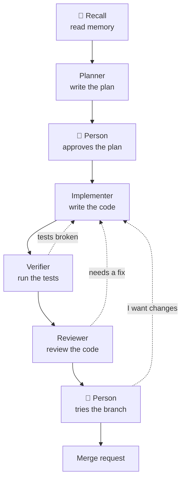

# The dev workflow

## Summary

`/gate:run dev "task"` makes gate work like a team: it reads what the team
already knows, plans, has the person approve the plan, writes the code,
tests it, reviews it, lets the person try it, and opens a merge request.
Every run works on its own branch, never on the code the person is working
on, in the person's own Claude Code session on their machine, with every
model call through the gate, which holds the definitions and the history.

## How it works

### The dev pipeline



Dashed arrows are the ways back: when a problem is found, the work goes
back to the implementer. The model does not decide the next step; the
workflow file does. An agent only says "approved" or "rejected", and the
rules in the file decide the rest.

| Agent | What it does |
| --- | --- |
| 🧠 **Recall** | Finds what memory holds about this task and writes the planner a short brief |
| **Planner** | Reads the brief and the code, asks the person when it must, writes a step-by-step plan file |
| **Clarify** | Carries the planner's questions to the person and the answers back |
| **Plan review** | Shows the person the plan: "shall we do it this way?" |
| **Implementer** | Does the plan step by step, test first, then the code; one commit per step |
| **Verifier** | Runs the project's whole test suite and checks every item of the plan was done |
| **Reviewer** | Reads the code and says "approved" or "fix this" |
| **Acceptance** | Tells the person "ready, try it" and asks whether to open the merge request |

The person is in the loop at three points — a **question** (clarify),
**plan approval** (plan review), **final approval** (acceptance) — and the
run waits until they answer. The plan is shown once: a revision of an
approved plan goes straight to the implementer. A rejection goes where the
reviewer says — a bounded fix to the implementer, a fault in the plan to
the planner — and acceptance splits the person's requests the same way.
Before the plan is shown, the planner may report that another team's
decision cannot be lived with here; the objection is put to the person
and, if confirmed, the run stops at `blocked-by-objection` (see
`memory.md`). There are no engine ceilings: loops end on the workflow's
own give-up edges — `review-stuck`, `not-verified`, `no-spec`,
`not-shipped`, `nothing-changed` — which say what is stuck. The starting
commit is recorded first and every diff is taken against it, because the
implementer commits as it goes and a plain `git diff` would show a finished
run as empty. The plan file stays under `docs/plans/`, ignored by a
`.gitignore` of `*`; its reasoning travels in the implementer's summary,
the commit's body, and the plan itself, as finished, is copied by the
implementer to `docs/specs/` as the run's last commit. Between the verifier
and the diff, the `record` command node checks that the spec is there —
the one fact about the repository's record that needs no model to judge —
and sends the implementer back with what to write when it is not, three
times, before the run ends on `no-spec`. The plan's `## Documentation`
section names the design doc and the decision record the change has to
leave true under `docs/design/` and `docs/decisions/`; the implementer
writes them as the plan's last task, and the verifier and reviewer hold
the change against them. The merge request is opened with `glab` when
signed in, else with GitLab push options. There is no `npm ci` and no `npm test` in the graph:
those are facts about one project, for `/gate:design` to add.

### The shipped pipelines

**`dev`** is the road above; its four working agents follow no skill.
**`dev-super`** is the same graph to the byte — derived from `dev`'s text,
not copied, so the two cannot drift — with the four working agents swapped
for their `super-*` counterparts, which follow the superpowers skills (a
spec document, a ledger, a subagent per task, a dispatched reviewer); it is
the only shipped pipeline that needs skills imported. **`dev-quick`** is the
short road for a change that needs no plan — a colour, a label, a default,
a small fix: no planner, no verifier, no skills. The quick implementer
makes the change, runs the project's own check for the files it touched,
keeps the design doc's sentence true when the behaviour it describes
changed, and writes a short spec under `docs/specs/` — the task as given
and what was done — which the same `record` node checks for; the quick
reviewer reads the diff itself, and the person is in it once, at
acceptance. A task that turns out not to be small, or that would need a
decision record, ends at `nothing-changed` with the reason, so it can go
through `dev` instead.
Both roads read memory first. Two more roads build nothing. **`blame`** is
for something that used to work: recall lists the runs, commits and
decisions that touched the area, the investigator reads the code and the
history against that and says how sure it is — *related*, *suspected*,
*confirmed*, *verified* — and the run ends with a report, a tried fix left
uncommitted in the worktree. **`ask`** is the road `gate ask` takes when
memory cannot answer: another team's source read at one fixed commit by a
single agent with no writing tools and no command tool.

### Installing and connecting

`/plugin marketplace add uguratadargun/gateway`, `/plugin install
gate@gateway`, then once per machine `/gate:login <token>` with the token
the `/team` page hands over. A team on its own git host installs from
there (`/plugin marketplace add git@gitlab.example.com:group/gateway.git`);
the marketplace keeps its name, and the Settings page's **Marketplace
source** (or `GATE_PLUGIN_SOURCE`) is what the `/team` page hands out. The
token carries the gate's address and the person's key; it is written to
`~/.gate/client.json` (0600) and the team's definitions are pulled on the
spot. In a terminal the same is `gate login <token>`; `gate install` writes
a `gate` shim into `~/.local/bin`, which the slash commands do not need —
they call the bundled script (`plugins/gate/scripts/gate.mjs`, built by
`npm run build:cli`) through `${CLAUDE_PLUGIN_ROOT}`.

### What travels where

**Definitions come down.** `gate pull` mirrors the team's agents and
workflows into `~/.gate/cache/<team>/`, keyed by a hash the server answers
`304` for; the mirror is replaced on the next pull. **Model calls go up**
to `<gate>/api/gateway` on the person's own key, carrying `x-gate-session:
workflow:<execution-id>`; routing, caching, the pool, budget and the
traffic log apply as on the server. **Progress goes up** in batches to
`/api/v1/executions/…` about once a second; what comes back is the
person's own runs, never a teammate's, on `/api/v1/executions/stream`
together. **The work stays here**, on a branch of the person's clone from
their HEAD — so `/gate:run` is safe to start mid-task — in a worktree
removed when the run ends, the branch keeping everything (see
`workspaces.md`); the diff is uploaded once, at the end. For a workflow
pinned to a connected repository, `gate repo <id> <path>` names the clone.

### Keeping up to date

*Definitions* look after themselves: every command sends the mirror's hash
as `If-None-Match` first, gets a `304` when nothing changed and the whole
bundle when it did, with anything the server no longer has pruned. A run
already going is the exception: `begin` pins the definitions as they were,
and every later step reads the pin, so an edit changes the next run and
never the graph under one that is walking it. Offline falls back to the
mirror. *The server* is the deploy; migrations are idempotent on open.
*The CLI* is `/gate:update`, per machine: it refreshes the marketplace,
re-installs the plugin and asks for a restart — by hand, `claude plugin
marketplace update gateway`, then `claude plugin update gate@gateway`, in
that order. Anything under `plugins/` or `src/client/` needs a version
bump: installs are cached by version
(`~/.claude/plugins/cache/<marketplace>/<plugin>/<version>`), so changed
contents under the same number are fetched and ignored, and `npm run
build:cli` refuses to build when `plugin.json`, the marketplace entry and
`GATE_VERSION` disagree. Every `/api/v1` response carries `x-gate-server`
and `x-gate-min-cli`; a client below the minimum is refused with
`CLIENT_TOO_OLD` and the command that fixes it; `MIN_CLIENT_VERSION` in
`src/lib/protocol.ts` is raised only by a change that breaks older clients.

### The run happens in your session, not beside it

`/gate:run` is the run: gate says what the next node is and it is done on
the person's machine, in front of them, following the agent's `executor`.
An `executor: gate` node is done by the session itself, with its tools and
permissions — the person can watch it, interrupt it, and answer it when it
asks, which is what `acceptance` does. An `executor: claude-code` node runs
as a spawned Claude Code in the agent's own model — a planner on GLM, an
implementer on a local model, which the session's model cannot stand in
for. `/gate:login` puts the person's Claude Code on the gateway (through
the `env` block of `~/.claude/settings.json`; `gate live` does the same per
repository, `gate env` prints it as shell exports), and those nodes then
run as subagents of the session, drawn live in the terminal, in the
agent's model — gate keeps the team's agents under `~/.claude/agents/` for
that, and a node's next pass continues the subagent that did its last one.
In a session not on the gateway they run as a detached worker (`gate
work`) the session follows with `gate wait`. Either way those nodes do not
ask; questions travel through `clarify`.

```bash
gate begin <workflow> "<task>"          # → the first instruction, as JSON
gate next <execution-id>                # → what to do now (no side effects)
gate step <execution-id> <node> --output-file <file>   # → hand back an answer
gate wait <execution-id>                # → follow a node running in its own model
gate live [--global] [--off]            # → put Claude Code here on the gateway, by its settings
```

`begin`/`step`/`wait` print the next instruction, so the loop is one call
per node. Only agent nodes reach the session; `command` nodes are argv from
the workflow file, so gate runs them itself. Where the run goes next is
still gate's — from the graph's edges and the outputs handed back, never
from the model — and an answer that does not match what the agent declared
is refused (`agent "planner" output invalid — ok: Required`). Progress is
reconstructed from the run's own steps, since each command is a new
process, by the engine's own traversal, except that a `parallel` node's
branches are walked one after another. `gate run` still runs the engine
headlessly, for CI and anything with no session.

`/usage` goes quiet on the gateway, since a session on gate has a gate key
rather than a subscription login; `/gate:usage` (or `gate usage`, `--json`)
answers in its words — *session limit*, *weekly limit*, what is left and
when it resets — for the pool's shared windows.

### Stop works in both directions

The server cannot reach into a process on a laptop, so for a run `gate run`
drives, Stop on the execution page records the request and the answer rides
back on the run's next report, within seconds, where it aborts the run as
a local Ctrl-C would. A run a session drives is settled on the spot: between
two `gate` calls there is no process to reach. The reverse also holds: a
server restart does not kill the run, and a run whose machine goes quiet —
fifteen minutes for `gate run`, six hours for a session — is `RUN_ABANDONED`.

### The person's time is not the run's

The shipped `clarify`, `plan-review` and `acceptance` nodes carry `asks:` —
`question` for the first, `approval` for the other two; the older `asks:
person` still reads as a question. While one is in the session's hands the
run shows as paused, its clock stands still, and it is never written off
for silence; `gate step` sets it running again. Every such node asks
through `AskUserQuestion`, never with a plain message that ends the turn,
so a Claude Code hook can carry the question out of the terminal and the
answer back; and every instruction handed out is also written to
`~/.gate/sessions/<claude-session>.json` — which run, which node, question
or approval — so a desktop cockpit can say which terminal wants you.

### A run is never cut off

No spend, step or visit ceiling applies to a run a session drives. An
agent's `timeoutMs` is a notice, not a kill: a node that runs past it says
so in its log, the session tells the person, and stopping is theirs. Cost
is read, not enforced: a node in its own model reports its usage; a node
the session did itself, or as its subagent, is costed afterwards from the
session's gateway calls in the step's window, as an attribution — which
needs the session hook to have named the session (`CLAUDE_ENV_FILE`).

### A failed node is not a lost run

The branch and every step before the failure are kept, and `gate continue
<execution-id>` checks the worktree out again from that branch and reopens
the run at the node that failed: the trailing failed steps leave the
history and `gate next` hands the node out again. Restart and Continue on
the execution page stay where the worktree is; here the page shows the command.

### The first run of a workflow asks

A team's `command` nodes and `run_command` tools execute on a developer's
machine, so before running a definition this machine has not seen at this
exact version, the CLI lists what it will run — the commands, and whether
its agents may write files — and asks. The approval is recorded against
the definition's hash, so an edited workflow asks again; `--yes` skips it,
`gate reset` clears them.

### Choosing the road

`/gate:run` alone offers the list; `/gate:run dev fix the flaky test` starts
that one and follows it to the end, `/gate:run dev-quick …` takes the short
road, `/gate:run dev-super …` is `dev` with the superpowers method. With no
workflow named, `/gate:run make the save button blue` picks the road
itself: `dev-quick` when the task adjusts something that exists in a file
or two and needs no design, otherwise the team's own pipeline for the
repository if `/gate:design` built one, else `dev`; it says which and why,
asks once when the task is on the line, and when a quick run ends "not
small" it starts the long road with the same brief.

### An example, across teams

1. The **android** team runs "add offline sync". Recall finds nothing; the
   planner plans from scratch. The work finishes.
2. The **recorder** writes an "Offline sync" row into `memory_features`,
   android's three decisions into `memory_decisions`, and android's summary
   into `memory_feature_impls`, with the pitfall *"do not trust the device
   clock"*.
3. Three months later the **desktop** team runs "it should save without
   internet too". **Recall** searches for "offline", "çevrimdışı"; the
   query returns android's "Offline sync", since both teams are in one tree.
4. The brief says: *"Android built this. Their method is as follows. Do not
   trust the device clock."* The **planner** adapts it, clock pitfall first.
5. The work finishes. The **recorder** opens no new feature; it files
   desktop's decisions under the **same** `offline-sync` row.
6. When iOS gets the same task, the query returns **both teams'** records.

### Designing a pipeline for a repository

`/gate:design <what it should do>` reads the repository it is in — package
manager, real test and lint commands, layout, conventions — and proposes
agents and a workflow shaped around what it found, given the authoring
reference (`plugins/gate/reference/authoring.md`) and told to reuse the
agents the team already has. It writes the proposal to `.gate-proposal/`
and saves it with `gate push .gate-proposal/*.md .gate-proposal/*.yaml`,
agents before workflows, because a workflow naming an agent the server does
not have yet is refused. Every push goes through the dashboard editor's
validation, so a wrong definition comes back as `prompt references
undeclared input: nobody.field` or `node "check" references unknown agent
"does-not-exist"` rather than failing mid-run. An existing id needs
`--replace`; pushing needs the `author` scope (`SCOPE_MISSING` otherwise).

## Key files

- `src/workflows/defaults.ts` — the shipped pipelines: `dev`, `dev-super` derived from it, `dev-quick`, `blame`, `ask`, with the reasoning for each edge
- `src/agents/defaults.ts` — the shipped agents and their `super-*` and `quick-*` counterparts, the investigator, source-review
- `src/client/cli.ts`, `step.ts` — the `gate` command (login, the mirror, the first-run approval, every subcommand) and the session-driven loop: `begin` / `next` / `step` / `wait`, the definition pin, the session pointer, the worker
- `src/client/walk.ts`, `run.ts`, `subagents.ts`, `cache.ts` — the replay, the headless engine, a claude-code node as a subagent, the mirror
- `src/lib/protocol.ts`, `src/app/api/v1/` — the version headers and `MIN_CLIENT_VERSION`; the client API: identity, the bundle, run registration, progress, stop, continue
- `plugins/gate/commands/run.md`, `design.md`, `login.md`, `update.md` — the slash commands; `plugins/gate/scripts/session-start.mjs` — the hook that names the session for costing

## Pitfalls

- A session not on the gateway runs claude-code nodes as detached workers, not live subagents; `gate live` or `/gate:login` puts it on.
- Editing a workflow in the dashboard does not change a run already walking it; the run keeps its pin until it ends.
- `claude plugin update gate@gateway` alone re-installs from an unrefreshed marketplace; use `/gate:update`, or update the marketplace first.
- Any change under `plugins/` or `src/client/` needs a version bump, or the update is fetched and ignored.
- A `command` node in a team pipeline runs on the developer's machine; the first-run approval is the only thing between a team's definition and their laptop.

## Decisions

- [0004 — The plan file is never committed](../decisions/0004-the-plan-file-is-never-committed.md)
- [0001 — The engine routes, never a model](../decisions/0001-the-engine-routes-never-a-model.md)
