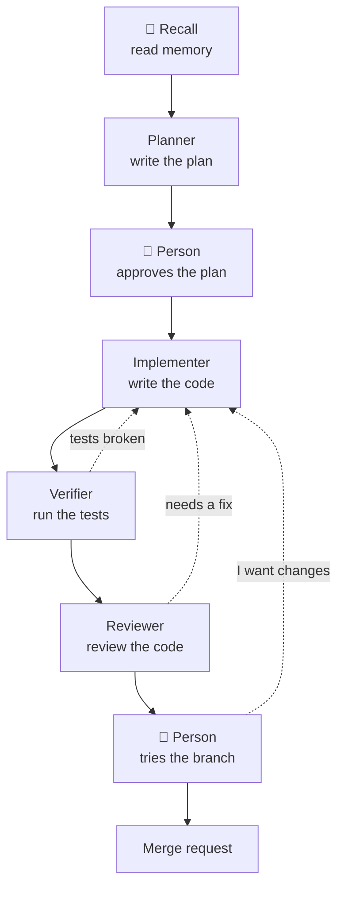

# The dev workflow

## Summary

`/gate:run dev "task"` makes gate work like a team: it reads what the team
already knows, plans, has the person approve the plan, writes the code,
tests it, reviews it, lets the person try it, and opens a merge request.
Every run works on its own branch, never on the code the person is working
on, in the person's own Claude Code session on their machine, and every
model call it makes is that person's own Claude Code on their own login. The
gate holds the definitions, the history and the memory; it holds no Claude
login and serves no models.

## How it works

### The dev pipeline


```mermaid
flowchart TD
  A["🧠 Recall<br/>read memory"] --> B["Planner<br/>write the plan"]
  B --> C["👤 Person<br/>approves the plan"]
  C --> D["Implementer<br/>write the code"]
  D --> E["Verifier<br/>run the tests"]
  E --> F["Reviewer<br/>review the code"]
  F --> G["👤 Person<br/>tries the branch"]
  G --> H["Merge request"]

  E -. "tests broken" .-> D
  F -. "needs a fix" .-> D
  G -. "I want changes" .-> D
```

Dashed arrows are the ways back: when a problem is found, the work goes
back to the implementer. The model does not decide the next step; the
workflow file does. An agent only says "approved" or "rejected", and the
rules in the file decide the rest.

| Agent | What it does |
| --- | --- |
| 🧠 **Recall** | Finds what memory holds about this task and writes the planner a short brief |
| **Planner** | Reads the brief and the code, asks the person when it must, writes a step-by-step plan file |
| **Clarify** | Carries the planner's questions to the person and the answers back |
| **Plan review** | Shows the person the plan: "shall we do it this way?" |
| **Implementer** | Does the plan step by step, test first, then the code; one commit per step |
| **Verifier** | Runs the project's whole test suite and checks every item of the plan was done |
| **Reviewer** | Reads the code and says "approved" or "fix this", and whether the "this" is only the record |
| **Record fix** | Rewrites the document, the changelog line or the spec a review rejected, and may touch nothing else |
| **Decide** | Rules on the planner's questions where there is nobody to ask: `dev-auto` only |
| **Acceptance** | Tells the person "ready, try it" and asks whether to open the merge request |

The person is in the loop at three points — a **question** (clarify),
**plan approval** (plan review), **final approval** (acceptance) — and the
run waits until they answer. The plan is shown once: a revision of an
approved plan goes straight to the implementer. A rejection goes where the
reviewer says — a bounded fix to the implementer, a fault in the plan to
the planner — and acceptance splits the person's requests the same way. A
rejection whose findings are *all* about the record takes a third way: the
reviewer sets `recordOnly`, the `record-fix` agent rewrites what it named
and may not touch a line of source, and the diff goes straight back to
review with no rebuild and no re-verification — a lap here is about fifty
minutes whatever the size of the finding, and three documentation
sentences once ended a run as failed with every code defect already fixed.
Two such rounds are allowed; a record still wrong after them ends on
`record-wrong`, which says the code was accepted and the writing was not.
Before the plan is shown, the planner may report that another team's
decision cannot be lived with here; the objection is put to the person
and, if confirmed, the run stops at `blocked-by-objection` (see
`memory.md`). There are no run ceilings: loops end on the workflow's
own give-up edges — `review-stuck`, `record-wrong`, `not-verified`,
`no-spec`, `not-shipped`, `nothing-changed` — which say what is stuck. The
review loop's give-up edge is written three times over, because it means
"four reviews that were not record rounds" and the condition language has
no arithmetic: a visit is counted when a node runs, before its edges are
read, so a record round would otherwise spend one of the four. The starting
commit is recorded first and every diff is taken against it, because the
implementer commits as it goes and a plain `git diff` would show a finished
run as empty. That diff is taken `--stat`: the node's one job is to say
whether anything was built and in what shape, and the reviewer runs its own
full `git diff` inside its own node, where the reading is its business
rather than the whole run's. The plan file stays under `docs/plans/`, ignored by a
`.gitignore` of `*`; its reasoning travels in the implementer's summary,
the commit's body, and the plan itself, as finished, is copied by the
implementer to `docs/specs/` as the run's last commit. Between the verifier
and the diff, the `record` command node checks the two facts about the
repository's record that need no model to judge: that the spec is there,
and that no decision record this branch added uses a number the remote's
base branch already holds for another record. It fetches that branch to
check, and skips the number check when the remote cannot be reached. When
either check fails it sends the implementer back with what to write or
what to renumber, three times, before the run ends on `no-spec`
([0040](../decisions/0040-a-decision-number-is-checked-against-the-remote.md)). The plan's `## Documentation`
section names the design doc and the decision record the change has to
leave true under `docs/design/` and `docs/decisions/`; the implementer
writes them as the plan's last task, and the verifier and reviewer hold
the change against them. The merge request is opened by the host the remote
names: `gh pr create` on a GitHub remote, and on anything else `glab` when it
is signed in, else GitLab's push options. A GitHub remote on a machine whose
`gh` is not signed in ends the run saying so, rather than pushing a branch no
pull request will point at — GitHub has no push option that opens one, so
there is nothing there to fall back to. Because that is only found at the
end, `gate begin` asks first: a workflow with a `gh pr create` node, on a
GitHub remote, on a machine whose `gh auth status` fails, starts with a `⚠`
line saying to run `gh auth login`, and the session passes it on. It warns
and does not refuse — a run that stops at the commit never reaches the node
([0051](../decisions/0051-a-run-warns-at-its-start-about-what-its-end-needs.md)). There is no `npm ci` and no `npm test` in the graph:
those are facts about one project, for `/gate:design` to add.

### The shipped pipelines

**`dev`** is the road above; its four working agents follow no skill.
**`dev-super`** is the same graph to the byte — derived from `dev`'s text,
not copied, so the two cannot drift — with the four working agents swapped
for their `super-*` counterparts, which follow the superpowers skills (a
spec document, a ledger, a subagent per task, a dispatched reviewer); it is
the only shipped pipeline that needs skills imported. **`dev-quick`** is the
short road for a change that needs no plan — a colour, a label, a default,
a small fix: no planner, no verifier, no skills. The quick implementer
makes the change, runs the project's own check for the files it touched,
keeps the design doc's sentence true when the behaviour it describes
changed, and writes a short spec under `docs/specs/` — the task as given
and what was done — which the same `record` node checks for; the quick
reviewer runs its own `git diff`, and the person is in it once, at
acceptance. A task that turns out not to be small, or that would need a
decision record, ends at `nothing-changed` with the reason, so it can go
through `dev` instead.
**`dev-auto`** is `dev` with nobody in the loop, for a task settled well
enough to hand over and read back as a merge request: the same working
four, the same verifier, spec check, diff and review, and none of the three
gates. The planner still asks what it judges to be the person's — its rule
that a ruling made on the person's behalf is a defect is not rewritten — but
on this road the `clarify` node is the shipped `decide` agent, which keeps
the node's id because the planner reads its answers under it, and rules
from the planner's own recommendation, the repository's record and memory,
handing the answers back marked as the run's so the planner writes them into
the plan's assumptions; they reach the person in the spec and the merge
request, where they can be undone. Nothing is shown before the build and
nothing is tried before the push: the reviewer's approval is what reaches
the `delivery` gate, and the gate reads the run input `deliver`. Left
unset it means the whole road — push, then the merge request. Set to
`branch` it stops at the commit, on the terminal `committed`, which is a
`completed` run: the work is done and reviewed, and the push is the
person's. It is a run input no agent node reads, so it never becomes
required and every existing `gate begin dev-auto` call still means what it
meant. When the push or the merge request itself fails the run ends on
`not-shipped`, which says what is true — reviewed and committed on the
branch, the delivery is what broke — rather than describing the whole run
as a failure. Three rounds of answers that still end in a question end the
run on `never-planned`, and a planner that objects to another team's
decision ends it on `objection-needs-a-person` — an objection is a request
to another team, and nobody on this road can confirm one, so that task goes
through `dev`. It is written out rather than derived from `dev` — the
difference is the person's six turns, the four terminals that exist only to
hold for them, and the four ids this road adds, not a renaming — and a test
holds it to `dev`'s
shape node by node. The road is never picked on the person's behalf; they
name it.
Every road that builds reads memory first. Two more roads build nothing. **`blame`** is
for something that used to work: recall lists the runs, commits and
decisions that touched the area, the investigator reads the code and the
history against that and says how sure it is — *related*, *suspected*,
*confirmed*, *verified* — and the run ends with a report, a tried fix left
uncommitted in the worktree. **`ask`** is the road `gate ask` takes when
memory cannot answer: another team's source read at one fixed commit, by
the asker's own session, through the read-only `gate source tree`, `gate
source grep` and `gate source file` views the gate serves. It has no
workspace, and nothing of the other team's repository lands on the asker's
disk.

### Installing and connecting

`/plugin marketplace add uguratadargun/gateway`, `/plugin install
gate@gateway`, then once per machine `/gate:login <token>` with the token
the `/team` page hands over. A team on its own git host installs from
there (`/plugin marketplace add git@gitlab.example.com:group/gateway.git`);
the marketplace keeps its name, and the Settings page's **Marketplace
source** (or `GATE_PLUGIN_SOURCE`) is what the `/team` page hands out. The
token carries the gate's address and the person's key; it is written to
`~/.gate/client.json` (0600), the team's definitions are pulled on the spot,
and the team's agents are written as subagents under `~/.claude/agents/`.
Logging in leaves Claude Code on the person's own login: it touches Claude
Code's settings only to take out gateway wiring an older gate put there. In
a terminal the same is `gate login <token>`. The plugin's SessionStart hook
(`plugins/gate/scripts/session-start.mjs`) does three things on every
session: it writes the `gate` shim into `~/.local/bin` (`gate install` does
the same by hand); it removes any old gateway wiring from
`~/.claude/settings.json` and `./.claude/settings.local.json`, and says to
restart Claude Code once when it did; and it exports `GATE_CLAUDE_SESSION`,
so every `gate begin` names the session driving the run. The slash commands
do not need the shim — they call the bundled script
(`plugins/gate/scripts/gate.mjs`, built by `npm run build:cli`) through
`${CLAUDE_PLUGIN_ROOT}`.

A machine needs, besides the plugin and the token: Claude Code signed in to
the person's own Claude account, since every model call is theirs; git access
to the repository that can push, since the branch is pushed from here; `gh auth
login` for a GitHub remote, and `glab auth login` or just the SSH key for a
GitLab one, since the merge request is opened from here; and, for a workflow
that names a connected repository, `gate repo` mapping it to this person's
clone once. The gate's server needs none of these for runs: its only git
access is read-only fetches into its own checkouts, for the record index and
another team's questions, with whatever key its own user has.

### What travels where

**Definitions come down.** `gate pull` mirrors the team's agents and
workflows into `~/.gate/cache/<team>/`, keyed by a hash the server answers
`304` for; the mirror is replaced on the next pull. **Progress goes up** to
`/api/v1/executions/…` as each node starts and ends; what comes back is the
person's own runs, never a teammate's, on `/api/v1/executions/stream`
together. **Model calls stay with the person**: the session and its
subagents are their own Claude Code on their own login, and nothing about
them reaches the gate. **The work stays here**, on a branch of the person's clone from
their HEAD — so `/gate:run` is safe to start mid-task — in a worktree
removed when the run ends, the branch keeping everything (see
`workspaces.md`); the diff is uploaded once, at the end. For a workflow
pinned to a connected repository, `gate repo <id> <path>` names the clone.

### Keeping up to date

*Definitions* look after themselves: every command sends the mirror's hash
as `If-None-Match` first, gets a `304` when nothing changed and the whole
bundle when it did, with anything the server no longer has pruned. A run
already going is the exception: `begin` pins the definitions as they were,
and every later step reads the pin, so an edit changes the next run and
never the graph under one that is walking it. Offline falls back to the
mirror. *The server* is the deploy; migrations are idempotent on open.
*The CLI* is `/gate:update`, per machine: it refreshes the marketplace,
re-installs the plugin and asks for a restart — by hand, `claude plugin
marketplace update gateway`, then `claude plugin update gate@gateway`, in
that order. Anything under `plugins/` or `src/client/` needs a version
bump: installs are cached by version
(`~/.claude/plugins/cache/<marketplace>/<plugin>/<version>`), so changed
contents under the same number are fetched and ignored, and `npm run
build:cli` refuses to build when `plugin.json`, the marketplace entry and
`GATE_VERSION` disagree. The bundle it writes is committed, so it is built
with symlinks left unresolved and comes out byte-identical wherever it is
run — a run rebuilding it inside its own worktree, whose `node_modules` is a
link to the checkout's, produces the same file the checkout does. Every `/api/v1` response carries `x-gate-server`
and `x-gate-min-cli`; a client below the minimum is refused with
`CLIENT_TOO_OLD` and the command that fixes it; `MIN_CLIENT_VERSION` in
`src/lib/protocol.ts` is raised only by a change that breaks older clients.
It is 0.47.0: an older CLI would hand nodes to a gateway that is not there.

### The run happens in your session, not beside it

`/gate:run` is the run: gate says what the next node is and it is done on
the person's machine, in front of them, following the agent's `executor`.
`gate next` hands the session one instruction at a time. `agent` is an
`executor: gate` node, done by the session itself, with its own tools and
permissions — the person can watch it, interrupt it, and answer it when the
agent declares `asks`, which is what `acceptance` does; an agent that reads
memory is told to run `gate memory search`, `gate memory feature` and `gate
memory history` in place of its memory tools. `delegate` is an `executor:
claude-code` node, and it is always a subagent of the session: started with
the Agent tool from `~/.claude/agents/gate-<team>-<agent>.md`, whose
`model:` is the agent's own model, drawn live in the terminal. The subagent
writes its answer to the file the prompt names, and the session hands that
file back with `gate step … --output-file … --subagent <agent id>`. A
node's next pass continues the subagent that did its last one with
SendMessage — addressed by the agent id the Agent tool returned, never by the
`gate-<team>-<agent>` type name of the file under `~/.claude/agents/`,
which resolves to nobody and starts a fresh subagent that reads the whole
worktree again. `gate step` refuses that name rather than recording a
resume target that will not work. A continued pass is sent only what
changed: gate rebuilds the node's inputs as they stood at its previous
visit, compares them to the inputs now, and the prompt is the ones that
differ under their own headings — an input that was filled last time and is
empty now is sent as *cleared*, so feedback since answered is not taken for
still open — the task, the brief and everything the
subagent read and decided are already in that conversation, and sending
them again was measured at thousands of tokens a pass and read by the
subagent as an instruction to start over. When nothing differs the whole
prompt is sent; and `gate next <execution-id> --full` gives it
back deliberately, which is what to do when the subagent is gone and the
pass has to start fresh. A subagent does not ask; questions travel through
`clarify`. `done`, `failed` and `stopped` say the run is over, failed at a
node, or was ended from outside. A node with no workspace is told to work
from what the prompt gives it and the commands it names, and to touch no
files on this machine.

```bash
gate begin <workflow> "<task>"          # → the first instruction, as JSON
gate next <execution-id> [--full]       # → what to do now, after running any command nodes on the way
gate step <execution-id> <node> --output-file <file> [--subagent <id>]   # → hand back an answer
gate continue <execution-id>            # → reopen a failed run at the node that failed
```

`begin`/`step`/`continue` print the next instruction, so the loop is one call
per node. Only agent nodes reach the session; `command` nodes are argv from
the workflow file, so gate runs them itself. Where the run goes next is
still gate's — from the graph's edges and the outputs handed back, never
from the model — and an answer that does not match what the agent declared
is refused (`agent "planner" output invalid — ok: Required`). Progress is
reconstructed from the run's own steps, since each command is a new
process: `nextInSession` replays them from the entry node with the same
edge selection, and walks a `parallel` node's branches one after another.
This is the only way a run is driven; nothing starts one from the
dashboard, a terminal with no session, or CI.

`gate next` is not a look: it runs every command node between here and the
next agent node. So one `gate` command works on a run at a time on a machine
— each holds `~/.gate/runs/<execution-id>.lock` while it works, a second is
refused with the holder's pid, and a lock whose process is gone is taken
over. Visit counts reach a node as the walk has them, its own pass included:
`visits.<node>` in an agent's inputs and in a command's argv is the same
number the edges read. A walk that cannot go on ends the run as failed
rather than wedging it — an edge whose condition cannot be evaluated against
what a node answered, a pinned definition that no longer loads — and an input
nobody produced, or a skill this machine has neither in the run's pin nor in
the team's mirror, fails the node as a recorded step before the node is
announced, so a person's turn is never paused on a node that cannot run. A
run the gate has closed is not walked forward, and a run whose workflow
works in a worktree but that has none on the record — it ended before one
was made — runs nothing anywhere: `gate next` fails it and `gate continue`
refuses it. The outcome is reported to the gate before the worktree and the
pinned definitions go; when the gate cannot be told, both stay and the next
`gate next` settles the run again. A node announcement that did not reach
the gate is made again the next time the node is handed out.

### Stop works in both directions

Stop on the execution page settles a session-driven run on the spot:
between two `gate` calls there is no process to reach. The session finds
out on its next call and ends the run's worktree the way a finished run
does. The reverse also holds: a server restart does not kill the run, and a
run whose session goes quiet for six hours is `RUN_ABANDONED`.

### The person's time is not the run's

The shipped `clarify`, `plan-review` and `acceptance` nodes carry `asks:` —
`question` for the first, `approval` for the other two; the older `asks:
person` still reads as a question. While one is in the session's hands the
run shows as paused, its clock stands still, and it is never written off
for silence; `gate step` sets it running again. Every such node asks
through `AskUserQuestion`, never with a plain message that ends the turn,
so a Claude Code hook can carry the question out of the terminal and the
answer back; and every instruction handed out is also written to
`~/.gate/sessions/<claude-session>.json` — which run, which node, question
or approval — so a desktop cockpit can say which terminal wants you.

### A run is never cut off

No spend, step or visit ceiling applies to a run a session drives; the
walk reads none of `maxWorkflowSteps`, `maxVisits` or `maxCostUsd`. An
agent's `timeoutMs` is a notice, not a kill: it is the point the person is
told the node is overrunning, and stopping is theirs. What a node costs is
on the person's own Claude plan: every agent node is the session or its
subagent, recorded with `costing: "session"` and no usage, and nothing on
the gate sees it.

### A failed node is not a lost run

The branch and every step before the failure are kept, and `gate continue
<execution-id>` checks the worktree out again from that branch and reopens
the run at the node that failed: the trailing failed steps leave the
history and `gate next` hands the node out again. The execution page shows
that command, with the host the run worked on, because the worktree and the
pinned definitions are on that machine.

### The first run of a workflow asks

A team's `command` nodes run on a developer's machine, and its agents work
there, so before running a definition this machine has not seen at this
exact version, the CLI lists what it will run — the commands, and for each
agent the tools it declares or that it is a subagent of the session — and
asks. The approval is recorded against
the definition's hash, so an edited workflow asks again; `--yes` skips it,
`gate reset` clears them.

### Choosing the road

`/gate:run` alone offers the list; `/gate:run dev fix the flaky test` starts
that one and follows it to the end, `/gate:run dev-quick …` takes the short
road, `/gate:run dev-super …` is `dev` with the superpowers method. With no
workflow named, `/gate:run make the save button blue` picks the road
itself: `dev-quick` when the task adjusts something that exists in a file
or two and needs no design, otherwise the team's own pipeline for the
repository if `/gate:design` built one, else `dev`; it says which and why,
asks once when the task is on the line, and when a quick run ends "not
small" it starts the long road with the same brief.

### The first time a repository meets gate

`/gate:init` runs once, before anything else, on a repository that has no
record: it reads the code, shows the key parts it found and lets the person
choose which to write, then writes `docs/ARCHITECTURE.md`, a design doc per
part, the decision records the code and the history actually show — marked
as inferred where the reason was never stated — `CLAUDE.md`, the changelog
and `docs/plans/.gitignore`. It never overwrites a document that is already
there, so running it again only fills gaps, and it commits nothing on its
own. The one file it edits is an existing `CLAUDE.md`: it appends the
record's table, or replaces an older wording of it with the reference's
current one, and it corrects the lines the code proves wrong — a path that is
gone, a version or command that disagrees with the file that owns it, a
statement about the code that is not true — and leaves every other line as
it was. It lists each correction, with the file that proves it, in its
report ([0049](../decisions/0049-init-corrects-what-the-code-proves-wrong-in-claude-md.md)). Before it names anything, it asks the gate two things: whether this
repository is connected and read (`gate memory repo`), and which features
the rest of the tree already has (`gate memory features`, then `gate memory
search` per part). A design doc for a feature a sibling already built takes
that feature's id as its file name, and an interface a sibling already lists
is written under the same name. The notes already under `docs/` are its
first reading.

Asked, it puts the work on a `gate-init` branch, one commit per feature with
its `Documents:` line and one for the skeleton, and pushes nothing. Once the
branch is merged and the repository is connected, the record index reads it
by code. Teaching is left for a repository the gate cannot connect
([0042](../decisions/0042-init-names-features-after-the-tree-and-leaves-reading-to-the-index.md)).
After it, recall answers about work that was finished long before gate.
`/gate:design` comes next, and the first `/gate:run` writes the first spec.

### An example, across teams

1. The **android** team runs "add offline sync". Recall finds nothing; the
   planner plans from scratch. The work finishes.
2. The **recorder** writes an "Offline sync" row into `memory_features`,
   android's three decisions into `memory_decisions`, and android's summary
   into `memory_feature_impls`, with the pitfall *"do not trust the device
   clock"*.
3. Three months later the **desktop** team runs "it should save without
   internet too". **Recall** searches for "offline", "çevrimdışı"; the
   query returns android's "Offline sync", since both teams are in one tree.
4. The brief says: *"Android built this. Their method is as follows. Do not
   trust the device clock."* The **planner** adapts it, clock pitfall first.
5. The work finishes. The **recorder** opens no new feature; it files
   desktop's decisions under the **same** `offline-sync` row.
6. When iOS gets the same task, the query returns **both teams'** records.

### Designing a pipeline for a repository

`/gate:design <what it should do>` reads the repository it is in — package
manager, real test and lint commands, layout, conventions — and proposes
agents and a workflow shaped around what it found, given the authoring
reference (`plugins/gate/reference/authoring.md`) and told to reuse the
agents the team already has. It writes the proposal to `.gate-proposal/`
and saves it with `gate push .gate-proposal/*.md .gate-proposal/*.yaml`,
agents before workflows, because a workflow naming an agent the server does
not have yet is refused. Every push goes through the dashboard editor's
validation, so a wrong definition comes back as `prompt references
undeclared input: nobody.field` or `node "check" references unknown agent
"does-not-exist"` rather than failing mid-run. An existing id needs
`--replace`; pushing needs the `author` scope (`SCOPE_MISSING` otherwise).

## Key files

- `src/workflows/defaults.ts` — the shipped pipelines: `dev`, `dev-super` derived from it, `dev-auto` written out and held to `dev`'s shape by a test, `dev-quick`, `blame`, `ask`, with the reasoning for each edge
- `src/agents/defaults.ts` — the shipped agents and their `super-*` and `quick-*` counterparts, the three gates to the person and `decide` in their place on the autonomous road, `record-fix`, the investigator, source-review
- `src/client/cli.ts`, `step.ts` — the `gate` command (login, the mirror, the first-run approval, every subcommand) and the session-driven loop: `begin` / `next` / `step` / `continue`, the instructions, the definition pin, the session pointer
- `src/client/walk.ts`, `subagents.ts`, `cache.ts` — the replay (`nextInSession`), the team's claude-code agents written as subagents under `~/.claude/agents/`, the mirror
- `src/client/preflight.ts` — what a run's end will need that this machine lacks (`gh` signed in for a GitHub pull request), said at `begin`
- `src/client/claude-settings.ts` — taking an older gate's gateway wiring out of Claude Code's settings at login and reset
- `src/lib/protocol.ts`, `src/app/api/v1/` — the version headers and `MIN_CLIENT_VERSION`; the client API: identity, the bundle, run registration, progress, stop, continue
- `plugins/gate/commands/run.md`, `design.md`, `login.md`, `update.md` — the slash commands; `plugins/gate/scripts/session-start.mjs` — the hook that writes the shim, removes old gateway wiring and names the session

## Pitfalls

- A `delegate` node's subagent is found by its file under `~/.claude/agents/`; Claude Code sees edits there within seconds, but the directory's very first file needs one restart to be seen.
- A run needs its session open for its length. One whose laptop slept or whose session closed is picked up with `gate continue <execution-id>` on that machine; six hours of silence write it off.
- Editing a workflow in the dashboard does not change a run already walking it; the run keeps its pin until it ends.
- `claude plugin update gate@gateway` alone re-installs from an unrefreshed marketplace; use `/gate:update`, or update the marketplace first.
- Any change under `plugins/` or `src/client/` needs a version bump, or the update is fetched and ignored.
- A `command` node in a team pipeline runs on the developer's machine; the first-run approval is the only thing between a team's definition and their laptop.
- The subagent files under `~/.claude/agents/` are one per team and agent, written from the team's mirror, so a running run's delegate uses the agent's current model and effort, not its pinned ones. An agent the team deleted keeps its file for as long as a pinned run on the machine still names it.
- A `.lock` left under `~/.gate/runs/` by a process that is still alive refuses every other command on that run; it is taken over only once that process is gone.
- The `begin` warning finds the pull-request node by `gh pr create` in its command; a team node that opens one some other way gets no warning, and fails only at the end.

## Decisions

- [0051 — A run warns at its start about what its end needs](../decisions/0051-a-run-warns-at-its-start-about-what-its-end-needs.md)
- [0048 — A question to another team is read on the asker's machine, from the commit the gate fixed](../decisions/0048-ask-is-read-on-the-askers-machine.md)
- [0047 — A run is driven only from a person's own Claude Code session](../decisions/0047-a-run-is-driven-only-from-a-persons-session.md)
- [0046 — Every person runs on their own Claude login; gate holds no model credentials and serves no models](../decisions/0046-every-person-runs-on-their-own-claude-login.md)
- [0042 — /gate:init names features after the tree, and leaves reading them to the index](../decisions/0042-init-names-features-after-the-tree-and-leaves-reading-to-the-index.md)
- [0040 — A decision number is checked against the remote before the branch is offered](../decisions/0040-a-decision-number-is-checked-against-the-remote.md)
- [0032 — The autonomous road can stop at the commit](../decisions/0032-the-autonomous-road-can-stop-at-the-commit.md)
- [0031 — A prompt carries what is new, not what was already read](../decisions/0031-a-prompt-carries-what-is-new-not-what-was-already-read.md)
- [0025 — The autonomous road answers the planner's questions itself](../decisions/0025-the-autonomous-road-answers-the-planners-questions-itself.md)
- [0004 — The plan file is never committed](../decisions/0004-the-plan-file-is-never-committed.md)
- [0001 — The engine routes, never a model](../decisions/0001-the-engine-routes-never-a-model.md)
