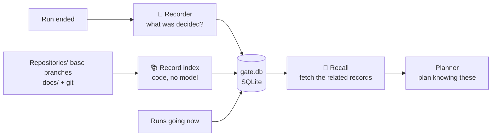
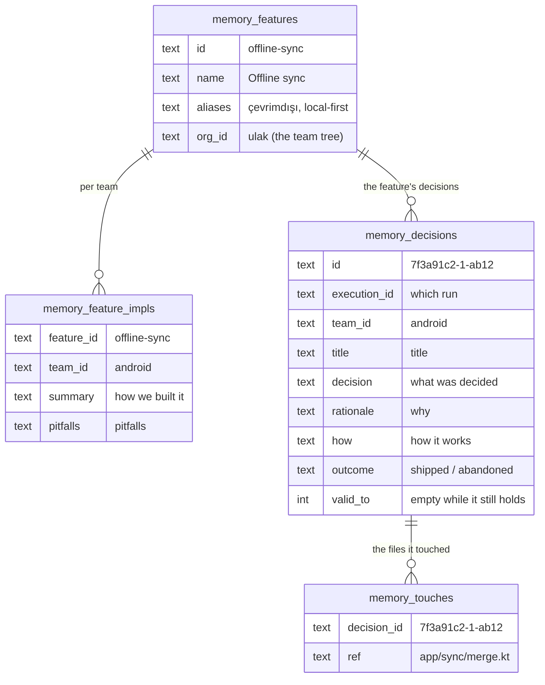
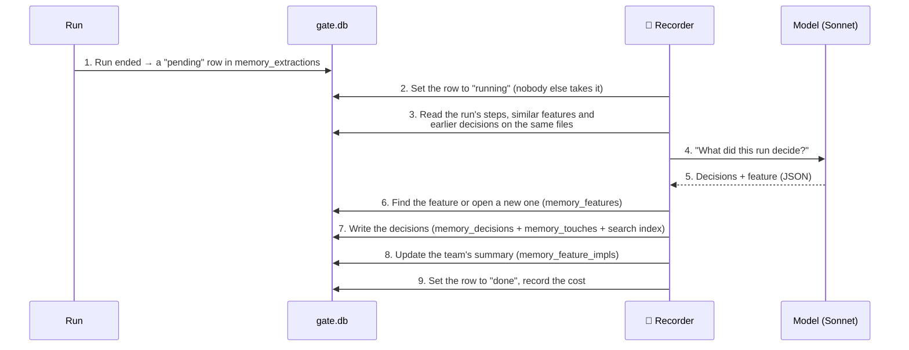
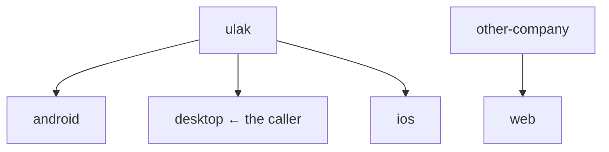

# Memory

## Summary

Every run leaves a record of what it decided, why, and how — logic, not
code — with the files it touched. Every connected repository's own record
(its design docs, decision records and specs) is read from its base branch
beside it. The next run reads both before it plans, together with whatever
else in the tree is being built right now. So:

- a feature one team built is found when a sibling is asked for it
- a deliberate decision is not undone by accident
- a refused road is not tried again
- two teams starting the same work hear about it

Older work can be taught in, a wrong record forgotten, and one team can
object to another's decision where its planner will read it.

## How it works

### The idea



There are three layers, each read for a different question:

- A **decision** is one run's own account, never rewritten. One that stops
  holding is retracted, and its replacement names it in `supersedes`.
- A **feature** is the catalogue entry a whole tree shares, with an
  **implementation** row per team.
- An **extraction** is the ledger row saying whether a run is recorded.

Beside them is the **record index**: each repository's documents as its
base branch has them, derived and rebuildable
([record index](record-index.md)). A design doc's file name is its
feature's id.

### How it is stored

Everything is in `~/.gate/gate.db` on the server. Five tables carry the record:



| Table | What it holds |
| --- | --- |
| `memory_features` | **The feature catalogue.** The feature's name and its other names. Owned by the root of a team tree, so everyone in the tree reads the same names. |
| `memory_feature_impls` | **One summary per team.** "How android built this, and which pitfalls it fell into." Pitfalls are a field of their own, so a consolidation pass cannot smooth them away. |
| `memory_decisions` | **The decisions.** One row each: title, context, decision, rationale, alternatives, how, consequences, which run, which commits (`base_commit..head_commit`), the repository, how far the work got, whether the approach was refused (`verdict`, `verdict_reason`), the team that owns it and the team whose run made it (`author_team_id`), and what the record index last found of its files (`checked_commit`, `missing_touches`). |
| `memory_touches` | **The files a decision touched.** One row per path or area, so "decisions about this directory" is an index range rather than a scan. |
| `memory_extractions` | **The recording ledger.** Which run was recorded, which is waiting, whether it failed, what it cost. |

Beside these: `memory_embeddings` (a vector per feature, decision and
indexed document, when a provider is configured), `memory_consolidations`
(the pass ledger), `decision_issues` / `decision_issue_approvals`
(objections and answers), and the record index's `record_repos`,
`record_docs`, `record_interfaces` and `record_docs_fts`. Two FTS5 indexes,
`memory_decisions_fts` and `memory_features_fts`, use Porter stemming so
"notify" finds "notifications".

`outcome` says how far the work got, and says no more than the evidence
shows:

- `merged`: the record index found the work on the base branch.
- `deployed`: nothing assigns it.
- `pr-open`: a merge request was opened, and the base branch does not
  have the work yet.
- `completed`: never offered for merge.
- `unshipped`: the branch never got that far.
- `in-progress`: a branch its teacher said is not finished, so the choices
  may still move.
- `abandoned`: the run failed or was stopped.
- `shipped`: what older rows and taught branches carry.

An outcome is not a verdict. `abandoned` says the run did not finish,
nothing about the idea. Whether the approach itself was refused (by the
reviewer, the verifier or a person) is `verdict: rejected`, with who and
why. Only a refused decision is a road found closed
([0035](../decisions/0035-an-unfinished-run-is-not-a-refusal.md)). A
decision recorded `in-progress` reaches a planner with a line telling it
to object now rather than build on the choice. Decisions are bi-temporal:
`valid_from`/`valid_to` for the world, `recorded_at`/`retracted_at` for
the row. So "what held on date D" is a range query.

### Recording



1. **Queueing.** However a run ends — completed, failed, stopped, written
   off after its machine went quiet — a `pending` row is added in the
   statement that closes the run; never a second one for the same run.
2. **Claiming.** The row is set to `running`; SQLite has one writer, so of
   two processes asking at once only one sees `changes: 1`. A `running` row
   whose process died is put back in line after thirty minutes.
3. **Reading.** The **agents' answers** from the steps — plan, implementer's
   summary, reviewer's verdict — not git output and not the recall brief;
   the decision records and design docs the run wrote, read from its diff
   as the added lines of `docs/decisions/*.md` and `docs/design/*.md`; and
   the catalogue's similar features and earlier decisions on the same files.
4. **Asking the model** (`memory.model` in Settings, `sonnet` by default),
   in one message. The rules: every real choice is a decision, logic not
   code, and the failed attempt counts too. A refused approach carries its
   verdict. Housekeeping (tests updated to match, regenerated output, a
   rename) is no decision. The answer is JSON: the decisions, and the
   feature.
5. **The feature.** A run that wrote exactly one design doc is filed under
   that doc's file name, whatever the model called it. Otherwise an
   existing entry is linked, or a new name opens a row, its id made from
   the name and unique within the gate.
6. **The decisions.** One transaction, so a run's record is whole or absent:
   a row per decision, a row per touched path, the text into the index. A
   record or design doc the run wrote carries its own path among the
   touches, so `gate memory search --path docs/decisions/0007` finds it.
   The decisions belong to the team whose repository the work was in, when
   that repository names a team in the run's tree. The run's own team is
   kept as the author
   ([0036](../decisions/0036-a-decision-belongs-to-the-repositorys-team.md)).
   A replaced decision gets `valid_to`, and only when it is the owner's own
   decision in the same repository.
7. **The summary.** The team's row in `memory_feature_impls` is updated.
8. **Closing.** The row becomes `done` with the count and the cost, on the
   run's page; on an error it becomes `failed` and is retried up to three
   times; **Record again** on the run's page asks once more, and **Record
   earlier runs** on `/memory` queues every finished run with no ledger row.

The recorder is a server-side job, not a node: a node at the end of the
graph never runs for a run that was stopped or failed on its last step —
exactly the runs whose decisions ("we tried X, the reviewer refused it
because Y") the next planner most needs. Agents cannot write to memory.
Updating a summary one run at a time drifts, so after every
`memory.consolidateEvery` new decisions (5 by default; 0 leaves it to the
button on `/memory`) a consolidation pass reads every decision under the
feature for that team, rewrites the summary and the pitfalls whole, and
closes the decisions a later one replaced — `valid_to` set, `supersedes`
filled, nothing deleted; a likely duplicate entry is proposed to a person,
never folded. Every pass is on the feature's page with its cost.

### Merges nobody ran through gate

With `memory.recordMerges` on (Settings → Memory, off by default), every
merge on a connected repository's base branch after the index first read
it becomes a finished run of `gate:merge` for the same recorder. The run
holds the merged commits' messages, the files, and the documents in the
merge's diff, and its decisions are recorded `merged`. Gate's own runs'
merges are skipped, and the history before the first read is left to
`/gate:teach`
([0041](../decisions/0041-merges-made-without-gate-are-recorded-when-asked.md)).

### Teaching work from before

Work finished before the team used gate has no run. `/gate:teach`, on the
finished task's branch, fills that in: `gate teach` works out the range —
the fork point from the default branch, or for merged work the point the
merge brought it in from (`--base` when history cannot say) — and Claude
Code reads the commits and the diff, asks the person only what the branch
cannot tell, and writes the account a run's agents would have left
(`task`, `plan`, `decisions`, `implementation`, `verification`,
`pitfalls`, `evidence`). `gate teach --account-file <f>` sends it; the
server keeps it as a finished run of `gate:teach`, dated at the branch's
last commit, for the same recorder. Teaching a branch again replaces the
earlier teaching; a branch a run already recorded needs `--force`.

A branch does not have to be finished. `--wip` says it is not, and its
decisions are recorded `in-progress` — worth teaching precisely so the
teams building against the work object while the choices can still move,
and never to be read as settled. Teaching it again without the flag, once
it lands, makes it the person's word again. `--task-id` files the teaching
under a cross-team task, which is usually how a task opened after the work
started gets anything under it.

### Reading

Recall runs before the planner and asks the server a few questions:

```mermaid
sequenceDiagram
  participant R as 🧠 Recall
  participant API as gate server
  participant DB as gate.db
  participant P as Planner

  R->>API: gate memory search "offline sync"<br/>(with the person's key)
  API->>API: key → team: desktop<br/>tree: ulak, android, desktop, ios
  API->>DB: search memory_features (the ulak catalogue only)
  API->>DB: search memory_decisions (these 4 teams only)
  DB-->>API: matching rows, best first
  API-->>R: Offline sync (android) + its decisions
  R->>API: gate memory feature offline-sync
  API->>DB: memory_feature_impls + that feature's decisions
  API-->>R: How android did it + pitfalls
  R->>API: gate memory search --path src/storage
  API->>DB: rows in memory_touches starting with src/storage
  API-->>R: Nothing recorded
  R->>P: Brief: "Android built this, like so;<br/>don't trust the device clock"
```

**Step 1: who may see what.** The server finds the caller's team from
their key, then that team's tree:



For desktop the readable teams are `ulak, android, desktop, ios`;
`other-company` and `web` never come back. The list is written into the
query — `team_id IN (…)` — never into a prompt. Teams nest by a parent on
the Team page.

A decision also carries its repository (`host/owner/name`). A *path*
search from a named repository hides decisions of a different named
repository, because a path means nothing elsewhere. A search in *words*
reads every repository of the tree, ranks this one's first, and names each
hit's repository
([0037](../decisions/0037-words-read-every-repository-paths-stay-in-their-own.md)).

**Step 2: search by words.** `gate memory search "retry for offline sync"`
becomes (simplified):

```sql
SELECT * FROM memory_decisions
WHERE search_index MATCH 'offline* OR sync* OR retry*'    -- filler words like "for" are dropped
  AND team_id IN ('ulak', 'android', 'desktop', 'ios')     -- your own tree only
  AND retracted_at IS NULL                                  -- retracted decisions excluded
ORDER BY
  team_id = 'desktop' DESC,                                 -- your own team first
  repo_id = 'github.com/ulak/desktop' DESC,                 -- then your own repository
  match_score                                               -- then the best match
LIMIT 10
```

A word in the **title** scores highest, then the decision text, then the
touched paths, and the consequences text least; every word is quoted, so a
stray `-` or `:` is not FTS syntax. The same search runs over
`memory_features` on names and aliases. Words miss "alerts" for
"notifications": an embedding model on an OpenAI-compatible provider
(Settings → Memory, `memory.embeddings`) gives every feature and decision
a vector, and a search then fuses word and vector rankings by reciprocal
rank fusion, own team first — over the ids the scope already allowed, so a
vector never widens what a team may read; without a provider the words
answer alone.

**Step 3: search by path.** `gate memory search --path src/storage`:

```sql
SELECT * FROM memory_decisions
WHERE id IN (
  SELECT decision_id FROM memory_touches
  WHERE ref LIKE 'src/storage%'        -- every file under this directory
)
  AND team_id IN ('ulak', 'android', 'desktop', 'ios')
ORDER BY team_id = 'desktop' DESC, valid_from DESC   -- own team first, then newest
```

(Really an index range over `memory_touches(ref, repo_id)`.) `--since 30d`,
`--as-of <date>` and `--feature <id>` narrow by time recorded, time held,
and feature.

A long word also asks for its first part as a prefix, which reaches a root
through a suffix in any language ("bildirimleri" finds "bildirim"). Porter
stems English only.

The same words search the record index's documents, and a search result
carries three more lists:

- **documents**: design docs, decision records and specs from the tree's
  repositories.
- **interfaces**: those the words name, with who provides and who
  consumes each.
- **inFlight**: other people's runs going right now whose task shares the
  words ([0039](../decisions/0039-work-in-flight-is-part-of-recall.md)).

**Step 4: opening a feature.** `gate memory feature offline-sync` returns:

- the feature
- **every team's** summary and pitfalls, own team first
- every repository's design doc for it, with its interfaces
- every decision under it, and the objections against them

**Step 5: history.** `gate memory history --path src/sync --since 30d` (the
`memory_history` tool) lists the commits on the repository's base branch
that touched the path, newest first: a person's commits as well as a
run's, each with the record its `Documents:` line names and the run it
came from.

**Step 6: rows become text** for the model:

```text
Features in the catalogue that match:
- offline-sync — Offline sync (also: çevrimdışı) · built by: android

## Çakışmada sunucu sürüm numarası kullan
id: 7f3a91c2-1-ab12 · team: android · shipped · from 2026-08-10
decision: İki cihaz aynı kaydı değiştirirse sunucudaki sürüm numarası kazanır.
why: Cihaz saatleri güvenilir değil, veri kaybı oluyordu.
how: Değişiklikler cihazda kuyrukta bekler, bağlantı gelince sırayla gönderilir...
touches: app/sync/merge.kt
```

Every decision is rendered this way, with a few extra markers:

- A closed decision carries `(no longer holds)` beside its dates.
- A refused one carries `✗ refused: <why>`.
- An `abandoned` one without a verdict reads "the run did not finish — not
  a refusal".
- One whose every file is gone from the base branch says it describes code
  that no longer exists.
- Work in flight comes first. Objections come last, never folded into the
  decisions above.

The same reads exist in three places:

- as agent tools: `memory_search`, `memory_feature` and `memory_history`,
  on the server or over HTTP with the person's key
- in a session: `gate memory search …`, `gate memory feature <id>`,
  `gate memory history …` and `gate memory activity`, run in the checkout,
  whose remote names the repository
- on the dashboard: `/memory`

### What recall searches, and what it writes into the brief

Recall searches from four angles, three to six searches in all:

- **by the feature's name** and its other names ("offline sync",
  "çevrimdışı", "local-first")
- **by the directories to be touched** (`--path src/storage`)
- when something broke, **by the recent past**: `--path src/sync --since
  30d`, then `memory_history` on the same paths
- when the task changes something another repository provides or
  consumes, **by the interface's name**

The brief is under about six hundred words, in these sections, any empty
one left out:

- **Objections standing against us** (first, when any)
- **Running now elsewhere**
- **Same feature elsewhere** (the design doc's summary and the decisions)
- **Earlier decisions in these areas**
- **Refused before**
- **Unfinished attempts** (said to be no refusal)
- **Interfaces**
- **What changed here** (the history's commits, each with its record and
  run)
- **Code that is gone**
- **Nothing found**: one line, and a real answer

`sources` lists every id cited, `objections` every open objection.
Recall's one rule: only what came back from the database, no guesses,
every claim with its id or its document's repository and path.

The planner then:

- **talks to** whoever is building the same thing now
- **adapts** a sibling's method, with their pitfalls
- **follows** a decision that holds in these files, or says explicitly
  that it changes it
- **does not go** down a road found closed by a refusal
- **weighs** an unfinished attempt on its merits

Otherwise it plans from code.

### Objections between teams

Only a team may close its own decision. An objection is how a sibling says
"this does not work on our side" where the sibling's next planner will read
it. When the shipped planner finds another team's decision cannot be lived
with here, the run puts the objection to the person (`conflict-review`),
and nothing reaches the other team until they confirm. It is written with
the step that raised it as `proposed`; a confirmation makes it `open`, the
state the target team's recall is shown; it never writes `valid_to` on
somebody else's decision. The team objected to may `resolve` it with a note
saying what was done, and the team that raised it may `withdraw` it — both
from the dashboard, neither from a run, and neither may do the other's;
`reject` is the raising side's own refusal before it is ever sent. It is
found by its paths and feature. An answer whose objection never reached the server is kept
and counted, and the count is shown to recall, so an empty list is not read
as agreement. When memory cannot answer another team's question about
code, `gate ask "<question>" --repo <host/owner/name>` runs the `ask`
pipeline over that team's published source at one fixed commit.

### Forgetting

A record that should never have been written — the recorder misread a run,
a taught branch was two tasks, a catalogue entry was a mistake — is deleted
from `/memory`, and the delete takes everything that pointed at it: the
full-text row, the touched paths, the vector, the team's decision count,
another decision's `supersedes` pointer, and the `valid_to` it had closed,
so the decision it replaced holds again. Three units: one decision, one
run's record (**Forget** on a run's page), and a feature with every team's
page, its consolidation history and its decisions. The run is never
touched; its ledger row is left saying `skipped — forgotten on request`,
so only **Record again** brings it back. The client API has no delete, so
no agent, run or CLI can forget anything.

### Who decides what

| Decision | Who makes it |
| --- | --- |
| Is the run recorded? | **Code** (every run is; a merge made without gate, when `memory.recordMerges` is on) |
| What do the repositories' documents say, did the work land, is its code still there? | **Code** (the record index, from the base branch) |
| Whose record is a decision? | **Code** (the repository's team, else the run's) |
| Was an approach refused? | **The recorder** (a model), from what the steps show |
| Is somebody building this now? | **Code** (shared words, counted) |
| Which decisions were made, and how are they written? | **The recorder** (a model) |
| Which feature does the work belong to? | **The recorder** proposes, **code** checks |
| Who may see which records? | **Code** (key → team tree → query) |
| Which record comes first? | **Code** (own team first, best match first) |
| What to search for, what to put in the brief? | **Recall** (a model) |
| How the brief shapes the plan? | **The planner** (a model) |

## Key files

- `src/memory/types.ts`, `store.ts` — the three layers and outcome values; the tables and the one way to read them, through a scope in the SQL; the extraction ledger
- `src/memory/extract.ts`, `queue.ts` — the recorder (steps, docs in the diff, neighbours, the prompt, the write) and when it runs, with the consolidation and embedding passes after it
- `src/memory/teach.ts`, `forget.ts`, `consolidate.ts`, `issues.ts` — teaching, forgetting, consolidation, objections
- `src/memory/hybrid.ts`, `embeddings.ts`, `cards.ts`, `access.ts` — words and vectors fused, for decisions, features and documents; the shared shapes and the text a model reads
- `src/memory/record-index.ts`, `merges.ts` — the repositories' record read from their base branches, the decisions reconciled against it, path history; merges made without gate
- `src/memory/activity.ts` — the tree's runs in flight, and the overlap told to both people
- `src/runtime/tools/memory-tools.ts`, `src/client/memory.ts`, `src/client/cli.ts` — the three read tools on the server and over the client API; `gate memory`, `gate teach`, `gate ask`
- `src/lib/db.ts` — the DDL and the FTS indexes; `src/app/api/memory/` (with `index/`), `src/app/api/v1/memory/` (with `history/` and `activity/`), `src/app/api/executions/[id]/memory/` — the routes

## Pitfalls

- Decisions are recorded once a run has ended; a search during a run does not see it, and a run that stopped at recall leaves nothing.
- Supersession is per team and per repository: a run cannot close a sibling's decision, and "we switched to X" in one repository does not close the other's. A decision record superseded on the base branch closes the decisions written from it; that is the repository owner's own record speaking.
- `pr-open` is not `shipped`. A decision becomes `merged` only when the record index reads a base branch that holds its work, so a repository with no checkout on the server never promotes anything.
- Decisions recorded before verdicts existed have none, and read as unfinished rather than refused; recording the run again gives them one. Decisions recorded before ownership followed the repository keep the team that ran them.
- The in-flight list is words counted, not understood: a task written as "fix it" overlaps with nothing, and two tasks that share a product's vocabulary can look closer than they are. The planner reads the line and judges it.
- Retracting and forgetting differ: a retracted decision still answers "what held on date D"; a forgotten one is gone and its ledger row says so.

## Decisions

- [0041 — Merges made without gate are recorded only when the gate is set to](../decisions/0041-merges-made-without-gate-are-recorded-when-asked.md)
- [0039 — Work in flight is part of recall, and an overlap is told to both people](../decisions/0039-work-in-flight-is-part-of-recall.md)
- [0038 — The repositories' record is read by code, and the base branch settles what landed](../decisions/0038-the-repositories-record-is-read-by-code.md)
- [0037 — Words read every repository of the tree, paths stay in their own](../decisions/0037-words-read-every-repository-paths-stay-in-their-own.md)
- [0036 — A decision belongs to the repository's team](../decisions/0036-a-decision-belongs-to-the-repositorys-team.md)
- [0035 — An unfinished run is not a refusal](../decisions/0035-an-unfinished-run-is-not-a-refusal.md)
- [0018 — Unfinished work is taught, and says it is unfinished](../decisions/0018-unfinished-work-is-taught-as-in-progress.md)
- [0016 — An objection is closed by the side it belongs to](../decisions/0016-an-objection-is-closed-by-the-side-it-belongs-to.md)
- [0010 — Forgetting is a person's, and only from the dashboard](../decisions/0010-forgetting-is-a-persons-and-only-from-the-dashboard.md)
- [0007 — A repository is named by its remote, and unknown is never guessed](../decisions/0007-a-repository-is-named-by-its-remote.md) (its read side for words superseded by 0037)
- [0003 — Ask answers from one commit](../decisions/0003-ask-answers-from-one-commit.md)
- [0002 — Objection record instead of messaging](../decisions/0002-objection-record-instead-of-messaging.md)
